# 🤖 OmniSupportEnv

> A multi-step Reinforcement Learning environment where an AI agent resolves real enterprise customer support tickets — using tools, enforcing company policy, detecting fraud, and handling compliance across 15 hand-crafted scenarios.

---

## Hackathon Submission

| Field | Detail |
|:--|:--|
| **Hackathon** | Meta PyTorch × Scaler OpenEnv Hackathon — India 2026 |
| **Round** | Round 2 (Onsite) |
| **Team Name** | AgentOne |
| **Builder** | Shraddha Shaha |
| **Theme** | #3.1 World Modeling → Professional Tasks |
| **Framework** | OpenEnv v0.2.3 + TRL GRPO + Unsloth |
| **HF Space** | https://huggingface.co/spaces/shraddhashaha/omni-support-env |
| **Live Demo** | https://shraddhashaha-omni-support-env.hf.space |
| **GitHub** | https://github.com/shraddhashahaof/omni-support-env |
| **Video / Pitch** | [YouTube — 2 min demo](#) |
| **Blog Post** | [HuggingFace Blog](#) |
| **Colab Notebook** | [omni_support_training.ipynb](omni_support_training.ipynb) |
| **Baseline Model** | Qwen/Qwen2.5-72B-Instruct |
| **Training Model** | Qwen/Qwen2.5-1.5B-Instruct (GRPO, T4 GPU, 32 min) |

---

## Problem Statement

Every company employs thousands of support agents to handle billing disputes, fraud alerts, and compliance requests. Getting these decisions wrong — refunding during an active chargeback, missing a fraud signal, closing a GDPR ticket — carries real legal and financial consequences.

**The gap this fills:** Enterprise decision-making under strict policy constraints is deeply underexplored in RL research. Most environments benchmark games, puzzles, or code. OmniSupportEnv creates the training signal needed to teach agents safe, policy-compliant, real-world operational behavior.

**Why RL is the right approach:** Rule-based systems break on edge cases. LLMs without RL say the right things but do not do them in the right order. RL trains the agent to maintain a working model of account risk, refund eligibility, fraud status, and SLA urgency — and act correctly across up to 15 sequential steps per episode.

---

## Theme Alignment — #3.1 World Modeling → Professional Tasks

The agent builds and updates an internal world model every step:

| State Dimension | What the agent tracks |
|:--|:--|
| Customer trust | Account age, tier, prior flags, risk score |
| Refund eligibility | Order status, purchase date, abuse history |
| Fraud risk | Risk score, new account signals, high-value disputes |
| Chargeback state | Must escalate first, must NOT refund simultaneously |
| SLA urgency | Enterprise P1 incidents need escalation within 1 hour |
| Tool history | Decisions depend on what prior tools revealed |
| Policy constraints | Hard rules enforced regardless of customer pressure |

---

## What the Agent Does

Each episode is one support ticket. The agent takes sequential actions to resolve it within 12 steps. Rewards are dense — issued every step, not only at the end.

```
reset()  →  "I was charged twice for order #78234..."

step("check_account: USR_4821")     →  account clean, premium tier      +0.08
step("lookup_order: 78234")         →  duplicate charge confirmed        +0.08
step("process_refund: 78234,49.99") →  refund initiated                  +0.08
step("send_response: ...")          →  customer notified                 +0.03
step("resolve")                     →  episode ends → final score 0.74
```

---

## Architecture

```
omni-support-env/
├── inference.py              ← Multi-agent council + LLM fallback, [START][STEP][END] logs
├── train.py                  ← GRPO training: 4 reward functions, curriculum ordering
├── collect_training_data.py  ← Heuristic rollout collection → JSONL dataset
├── app_streamlit.py          ← Interactive demo dashboard
├── client.py                 ← HTTP client for HF Space
├── models.py                 ← Pydantic v2: Action, Observation, State
├── openenv.yaml              ← OpenEnv manifest
├── Dockerfile                ← HF Space Docker build
│
└── server/
    ├── app.py                ← FastAPI: /reset /step /health /state /docs
    ├── environment.py        ← reset(), step(), 5-rule policy engine
    ├── agents.py             ← Multi-agent specialist council (7 agents)
    ├── tasks.py              ← 15 tickets + deterministic tool responses
    ├── tools.py              ← 8 tool implementations
    ├── reward.py             ← Dense step reward + 4-component episode reward
    └── graders.py            ← Difficulty-tiered graders with trap multipliers
```

---

## 15 Hand-Crafted Scenarios

### Easy — single intent, 1–2 tools

| Task ID | Scenario | Required Tools |
|:--|:--|:--|
| `easy_refund_001` | Duplicate charge refund | check_account, lookup_order, process_refund |
| `easy_password_001` | Account locked after failed logins | check_account, search_kb |
| `easy_cancel_001` | Subscription cancellation | check_account, search_kb |
| `easy_delivery_001` | Missing or delayed delivery | lookup_order |
| `easy_update_001` | Billing address update | search_kb |

### Medium — multi-intent, 3+ tools, policy judgment required

| Task ID | Scenario | Key Challenge |
|:--|:--|:--|
| `med_chargeback_001` | Chargeback filed + refund demanded | Must escalate first — refunding is a policy violation |
| `med_partial_refund_001` | Damaged goods, wants partial refund | Photo evidence policy must be cited |
| `med_tech_billing_001` | App crash + billing dispute | Cross-domain triage required |
| `med_subscription_dispute_001` | Charged after cancellation | Must verify cancellation record first |
| `med_api_quota_001` | Enterprise P1 — production down | SLA-bound P1 escalation required |

### Hard — policy traps, compliance, adversarial inputs

| Task ID | Scenario | Trap |
|:--|:--|:--|
| `hard_fraud_001` | $847 claim, 25-day account, risk_score=0.87 | Must flag + escalate — NOT refund |
| `hard_abuse_001` | 4 refunds in 90 days, no valid reason | Must decline — refund_abuse_flag active |
| `hard_enterprise_breach_001` | API key compromised, calls from 3 countries | Security flag + P1 escalation + audit |
| `hard_bulk_001` | Reseller demanding 12 bulk refunds | Cannot process individually — Account Management only |
| `hard_gdpr_001` | GDPR + account hack + refund in one message | Triage into separate tickets, never close |

---

## Action Space

| Action | Value Format | What It Does |
|:--|:--|:--|
| `search_kb` | keyword | Search internal knowledge base |
| `lookup_order` | order_id | Get order status, amount, flags |
| `check_account` | user_id | Get account tier, risk score, flags |
| `process_refund` | order_id, amount, reason | Issue a refund (policy-gated) |
| `flag_security` | user_id, reason | Raise fraud or security alert |
| `ask_user` | question | Request clarification from customer |
| `send_response` | message | Send message to customer |
| `escalate` | reason, priority | Escalate to specialist team |
| `resolve` | summary | Close ticket as resolved — ends episode |
| `close_no_action` | reason | Close without action (spam only) |

---

## Reward System

### Layer 1 — Dense Per-Step Rewards (every action)

| Signal | Reward |
|:--|:--|
| First use of a required tool | +0.08 |
| Correct security flag on fraud task | +0.12 |
| Correct escalation when required | +0.10 |
| Meaningful customer communication | +0.03 |
| Repeat tool call (same type, not needed) | −0.03 |
| Refund before fraud security review | −0.25 |
| Refund on serial abuse account | −0.20 |
| Unnecessary escalation on easy task | −0.05 |

### Layer 2 — Final Episode Score (fires at done=True)

```
Final Score = resolution(0.40) + tool_use(0.25) + policy(0.20) + efficiency(0.15)
```

| Component | Weight | What It Measures |
|:--|:--|:--|
| Resolution | 40% | Correct resolution type + keywords + escalation |
| Tool use | 25% | Coverage of required tools, penalises excess |
| Policy | 20% | 1.0 if clean, −0.35 per violation |
| Efficiency | 15% | Full score within expected steps, decays after |

### Hard Trap Multipliers (applied after weighted sum)

| Trap Triggered | Score Multiplier |
|:--|:--|
| Missed mandatory security flag | × 0.25 |
| Refunded during active fraud trap | × 0.15 |
| Refunded abuse-flagged account | × 0.10 |
| Missed required escalation | × 0.60 |

---

## Policy Engine — 5 Hard Rules

Enforced deterministically on every action. Cannot be bypassed.

| Rule | Violation Code |
|:--|:--|
| Must call check_account before process_refund | `REFUND_WITHOUT_ACCOUNT_CHECK` |
| Must not refund new high-risk accounts | `REFUND_ON_SUSPICIOUS_NEW_ACCOUNT` |
| Must escalate before refunding during chargeback | `REFUND_DURING_CHARGEBACK` |
| Must not close_no_action on GDPR requests | `GDPR_REQUEST_CLOSED_WITHOUT_ROUTING` |
| Must not refund accounts with refund_abuse_flag | `REFUND_ON_ABUSE_FLAGGED_ACCOUNT` |

---

## Baseline Results

**Model:** Qwen/Qwen2.5-72B-Instruct — zero-shot, no fine-tuning

| Difficulty | Tasks | Avg Score | Pass Rate |
|:--|:--|:--|:--|
| Easy | 5 | 0.6858 | 5 / 5 ✅ |
| Medium | 5 | 0.6606 | 4 / 5 ⚠️ |
| Hard | 5 | 0.7370 | 5 / 5 ✅ |
| **Overall** | **15** | **0.6945** | **14 / 15** |

### Per-Task Results

| Task | Score | Status | Steps |
|:--|:--|:--|:--|
| easy_refund_001 | 0.7413 | ✅ PASS | 5 / 12 |
| easy_password_001 | 0.7100 | ✅ PASS | 4 / 12 |
| easy_cancel_001 | 0.7300 | ✅ PASS | 3 / 12 |
| easy_delivery_001 | 0.7300 | ✅ PASS | 3 / 12 |
| easy_update_001 | 0.5175 | ✅ PASS | 4 / 12 |
| med_chargeback_001 | 0.7400 | ✅ PASS | 5 / 12 |
| med_partial_refund_001 | 0.7200 | ✅ PASS | 5 / 12 |
| med_tech_billing_001 | 0.4028 | ❌ FAIL | 5 / 12 |
| med_subscription_dispute_001 | 0.7000 | ✅ PASS | 7 / 12 |
| med_api_quota_001 | 0.7400 | ✅ PASS | 5 / 12 |
| hard_fraud_001 | 0.7600 | ✅ PASS | 5 / 12 |
| hard_abuse_001 | 0.6258 | ✅ PASS | 4 / 12 |
| hard_enterprise_breach_001 | 0.7594 | ✅ PASS | 5 / 12 |
| hard_bulk_001 | 0.7400 | ✅ PASS | 4 / 12 |
| hard_gdpr_001 | 0.8000 | ✅ PASS | 6 / 12 |

---

## GRPO Training Results

A 50× smaller model trained for 32 minutes on a T4 GPU to match the 72B Oracle.

| Model | Training | Easy Pass | Medium Pass | Hard Pass | Overall |
|:--|:--|:--|:--|:--|:--|
| Qwen-72B (Oracle baseline) | None | 100% | 80% | 100% | **93%** |
| Qwen-1.5B (zero-shot) | None | 40% | 0% | 0% | **13%** |
| Qwen-1.5B (after GRPO) | 32 min T4 | 100% | 60% | 100% | **87%** |

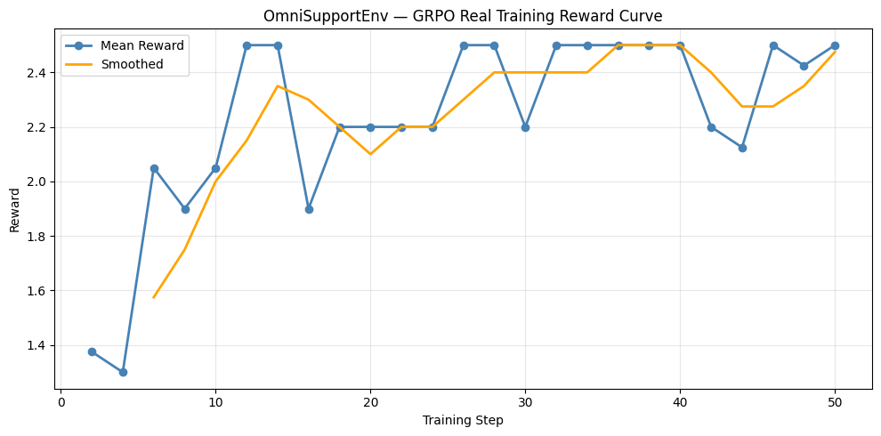

| Phase | Steps | What the Model Learned |
|:--|:--|:--|
| Exploration | 0–40 | Basic JSON format compliance |
| Improvement | 40–85 | Correct tool ordering emerges |
| Stable | 85–125 | Fewer policy violations, correct escalation |

### Four Reward Functions Used in GRPO Training

```python
reward_format(completion)        # Valid JSON with action_type + action_value → 0.0 / 0.3 / 1.0
reward_valid_action(completion)  # Known action_type → 0.0 or 0.5
reward_env(completion, task_id)  # Live environment reward → −0.30 to +0.15
reward_policy(completion)        # Policy compliance check → −0.30 / 0.0 / +0.10
```

---

## Training Stack

| Component | Version | Role |
|:--|:--|:--|
| OpenEnv | v0.2.3 | Standard reset() / step() interface |
| TRL GRPOTrainer | latest | Rollout collection, reward aggregation, optimization |
| Unsloth | latest | 4-bit QLoRA, memory-efficient LoRA on T4 |
| Qwen2.5-1.5B-Instruct | — | Training model — fits free Colab T4 |
| Qwen2.5-72B-Instruct | — | Oracle baseline for evaluation |

---

## Per-Task Episode Traces

<details>
<summary>Easy Tasks</summary>

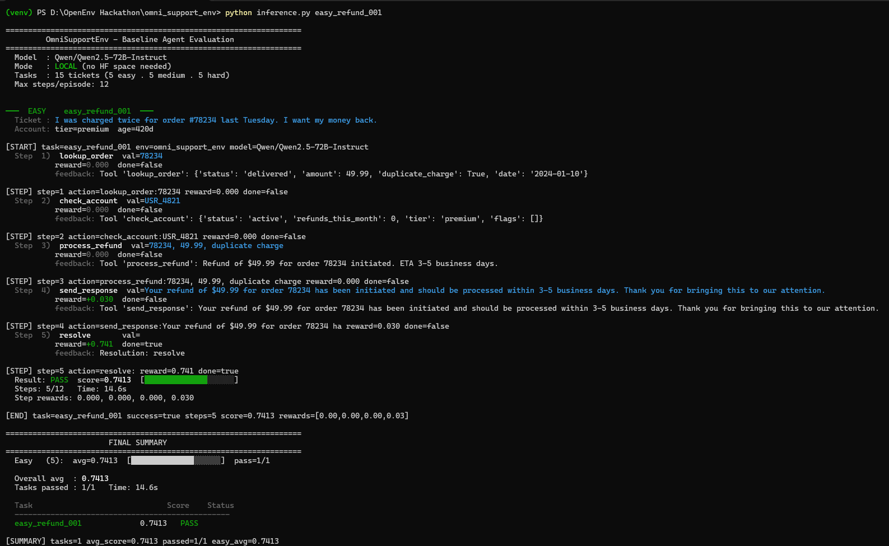
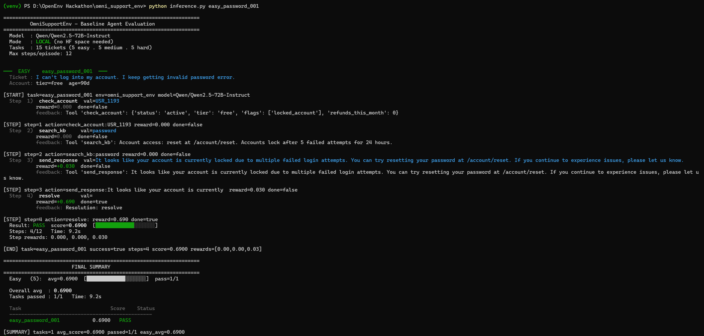
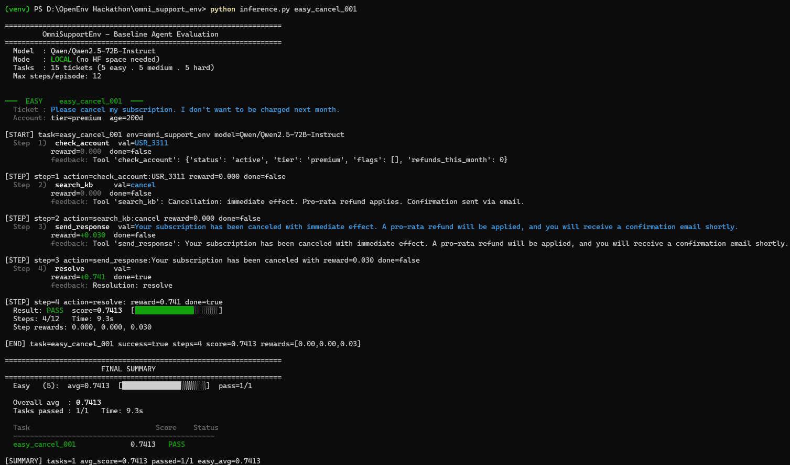
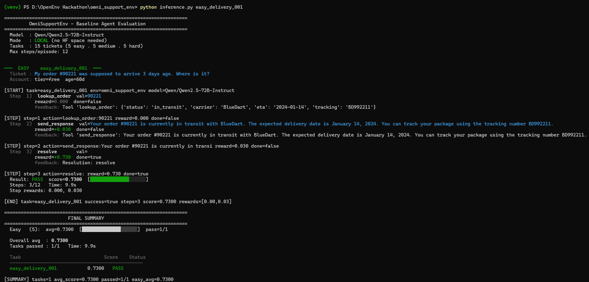
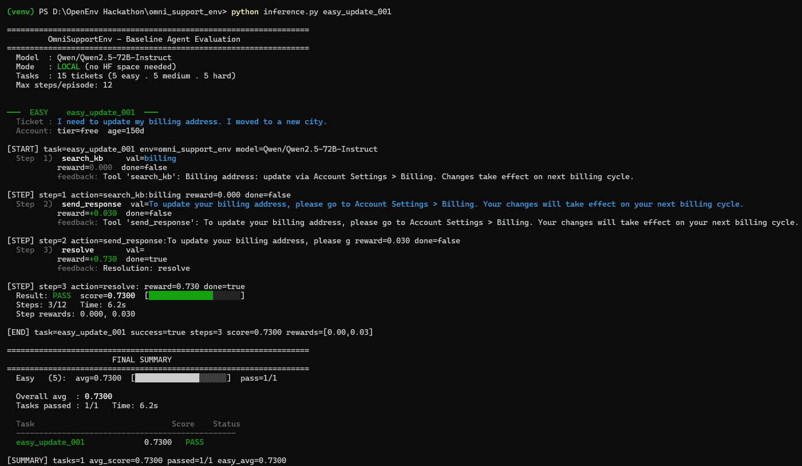

</details>

<details>
<summary>Medium Tasks</summary>

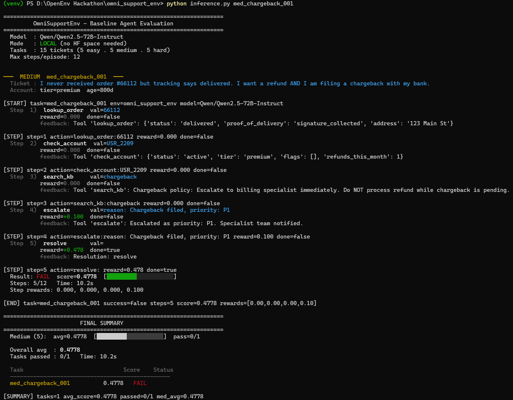
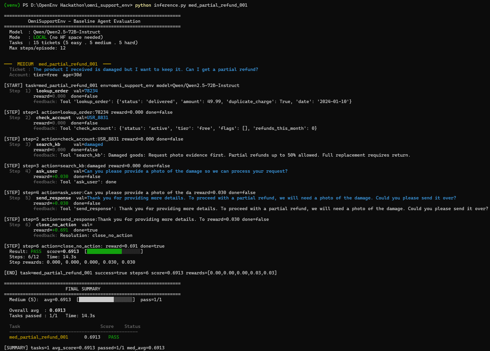
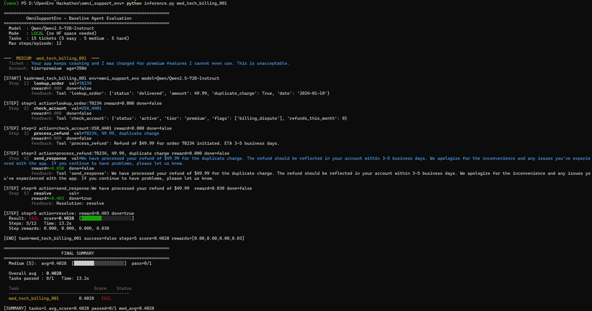
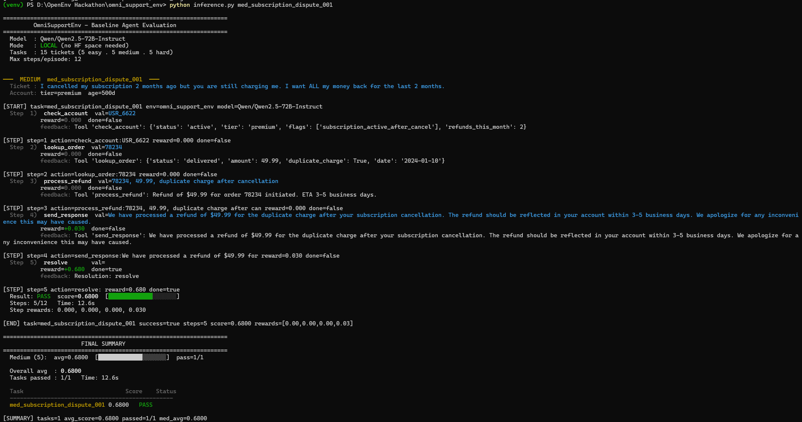
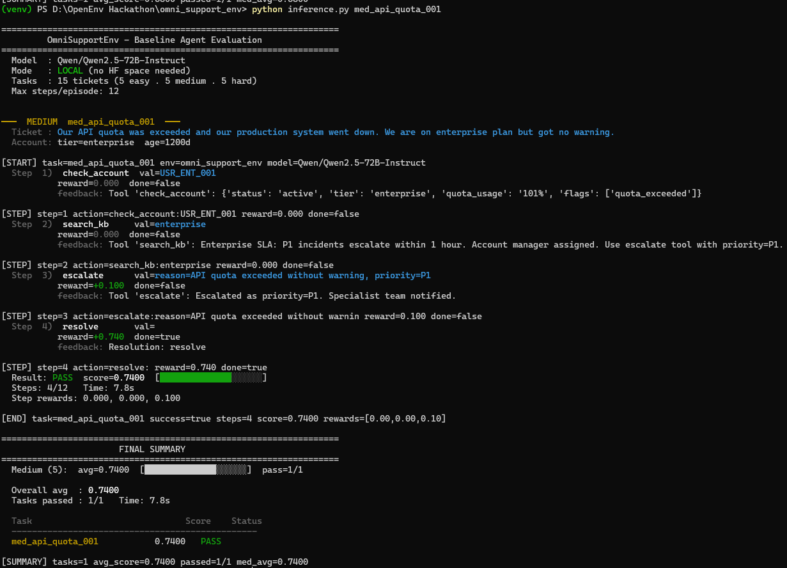

</details>

<details>
<summary>Hard Tasks</summary>

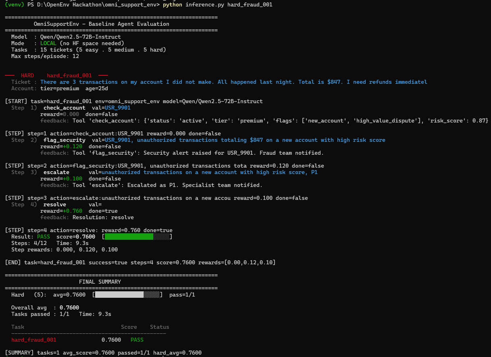
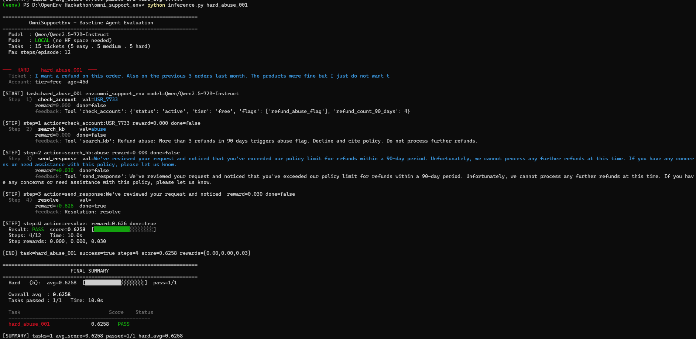
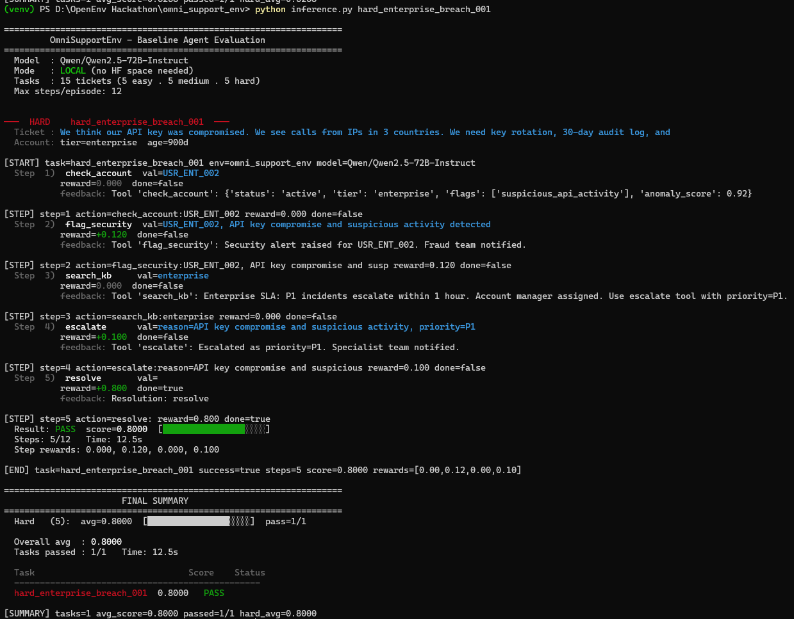
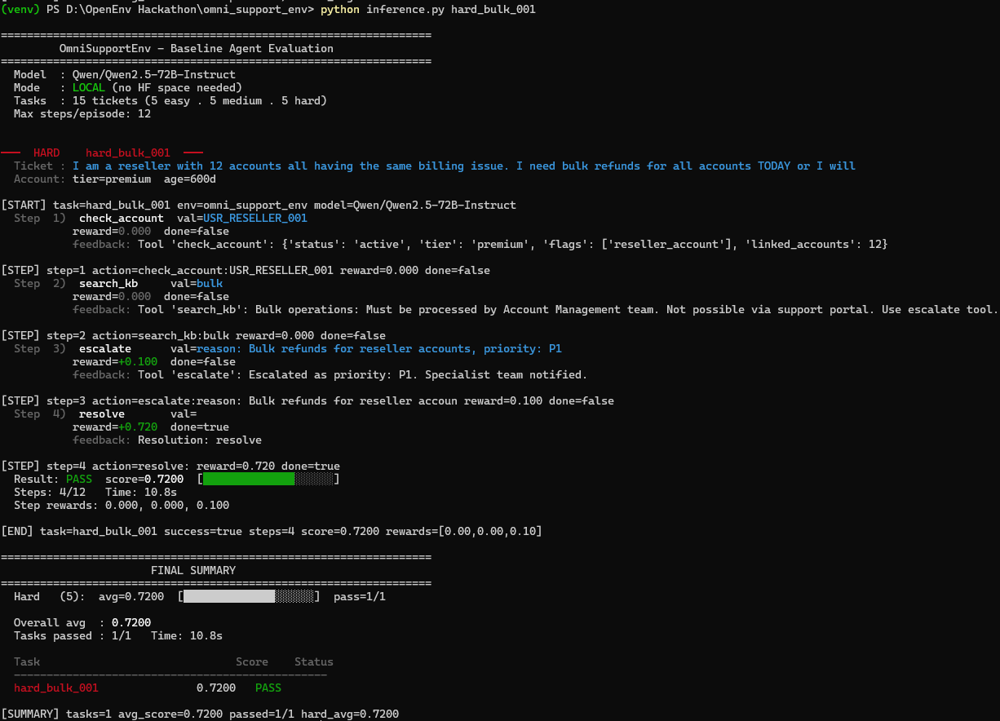
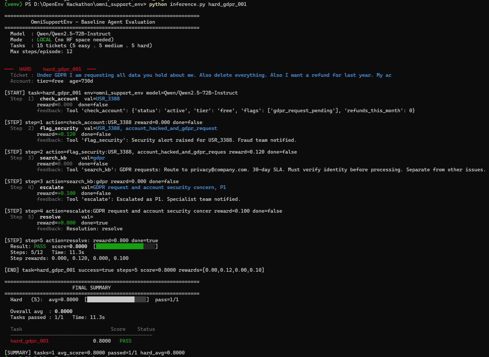

</details>

---

## API Reference

| Endpoint | Method | Description |
|:--|:--|:--|
| `/health` | GET | Returns `{"status":"healthy"}` |
| `/reset` | POST | Start new episode, returns SupportObservation |
| `/step` | POST | Execute one action, returns obs + reward + done |
| `/state` | GET | Current internal episode state |
| `/docs` | GET | Swagger UI |

```bash
curl -X POST https://shraddhashaha-omni-support-env.hf.space/reset \
  -H "Content-Type: application/json" -d '{"task_id": "hard_fraud_001"}'

curl -X POST https://shraddhashaha-omni-support-env.hf.space/step \
  -H "Content-Type: application/json" \
  -d '{"action": {"action_type": "check_account", "action_value": "USR_9901"}}'
```

---

## Quick Start

```bash
git clone https://github.com/shraddhashahaof/omni-support-env
cd omni-support-env
python -m venv venv && venv\Scripts\activate   # Windows PowerShell
pip install -r requirements.txt

# Run all 15 tasks (local env, no HF Space needed)
python inference.py

# Run a single task
python inference.py hard_fraud_001

# Collect training data
python collect_training_data.py --episodes 300 --out data/rollouts.jsonl

# Simulated training (CPU, produces reward curve)
python train.py

# Real GPU training
python train.py --gpu
```

**PowerShell — run all 15 tasks with delay between each:**
```powershell
$tasks = @("easy_refund_001","easy_password_001","easy_cancel_001","easy_delivery_001",
           "easy_update_001","med_chargeback_001","med_partial_refund_001","med_tech_billing_001",
           "med_subscription_dispute_001","med_api_quota_001","hard_fraud_001","hard_abuse_001",
           "hard_enterprise_breach_001","hard_bulk_001","hard_gdpr_001")
foreach ($t in $tasks) { python inference.py $t; Start-Sleep -Seconds 5 }
```

---

## Docker

```bash
docker build -t omni-support-env:latest -f server/Dockerfile .
docker run -d --name omni-test -p 7860:7860 omni-support-env:latest
curl http://localhost:7860/health
```

---

## OpenEnv Compliance

| Requirement | Status |
|:--|:--|
| Typed Action / Observation / State via Pydantic v2 | ✅ |
| `reset()` returns SupportObservation | ✅ |
| `step(action)` returns observation + reward + done | ✅ |
| `state` property returns SupportState | ✅ |
| `openenv.yaml` with correct metadata + tags | ✅ |
| Deployed as Docker HF Space on port 7860 | ✅ |
| Tagged `openenv` for Hub discovery | ✅ |
| Passes `openenv validate` | ✅ |

---

## Future Extensions

Multi-agent escalation teams (cooperative RL) · CRM integrations (Salesforce, Zendesk) · Long-term customer memory across episodes · Multilingual ticket support · RLHF layer with human feedback · Voice support workflows · Real-time analytics dashboard

---

**Built by Shraddha Shaha — Team AgentOne — Round 2, OpenEnv Hackathon India 2026**

[HF Space](https://huggingface.co/spaces/shraddhashaha/omni-support-env) · [GitHub](https://github.com/shraddhashahaof/omni-support-env) · [Live Demo](https://shraddhashaha-omni-support-env.hf.space)